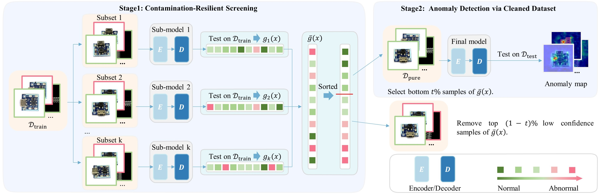

# Levarging Learning Bias for Noisy Anomaly Detection 
> 📚 [**Paper**](https://arxiv.org/abs/2508.07441) 
> by [Yuxin Zhang](https://hustzhangyuxin.github.io), [Yunkang Cao](https://caoyunkang.github.io/), [Yuqi Cheng](https://hustcyq.github.io/), [Yihan Sun](https://hustsyh.github.io/), [Weiming Shen](https://scholar.google.com/citations?user=FuSHsx4AAAAJ&hl=en),  


## 📊 Introduction  

This paper addresses the challenge of fully unsupervised image anomaly detection (FUIAD), where training data may 
contain unlabeled anomalies. Conventional methods assume anomaly-free training data, but real-world contamination leads 
models to absorb anomalies as normal, degrading detection performance. To mitigate this, we propose a two-stage 
framework that systematically exploits inherent learning bias in models. The learning bias stems from: (1) the 
statistical dominance of normal samples, driving models to prioritize learning stable normal patterns over sparse 
anomalies, and (2) feature-space divergence, where normal data exhibit high intra-class consistency while anomalies 
display high diversity, leading to unstable model responses. Leveraging the learning bias, stage 1 partitions the 
training set into subsets, trains sub-models, and aggregates cross-model anomaly scores to filter a purified dataset. 
Stage 2 trains the final detector on this dataset. Experiments on the Real-IAD benchmark demonstrate superior anomaly 
detection and localization performance under different noise conditions. Ablation studies further validate the 
framework's contamination resilience, emphasizing the critical role of learning bias exploitation. The model-agnostic 
design ensures compatibility with diverse unsupervised backbones, offering a practical solution for real-world scenarios 
with imperfect training data.

<div align="center">
  
</div>


## 🛠️ Getting Started  
### 📦 Environment Setup  
Clone and install dependencies:  
```bash  
git clone https://github.com/hustzhangyuxin/LLBNAD.git && cd LLBNAD 
conda create --name LLBNAD python=3.9 -y  
conda activate LLBNAD  

# Core dependencies  
pip install timm==0.8.15dev0 opencv-python==4.9.0.80 numpy==1.26  
pip install thop seaborn mmselfsup pandas transformers imgaug tensorboard  

# Optional extras  
pip install git+https://gitcode.com/gh_mirrors/cl/CLIP  
conda install -c conda-forge accimage  
pip install mmdet==2.25.3 adeval torch==2.1.2 --index-url https://download.pytorch.org/whl/cu118  
```  

### 📂 Dataset Preparation
- Download and extract [Real-IAD](https://realiad4ad.github.io/Real-IAD/) into `data/realiad`.
- Update `DATA_ROOT` and `DATA_SUBDIR` in `/data/dataset_info` to match your path.  

### 🚀 Train & Evaluate
```bash  
# Example: Train CDO on M2AD-Synergy  
CUDA_VISIBLE_DEVICES=0 python run_dataset.py --cfg_path configs/benchmark/dinomaly/dinomaly_100e.py -m train  
```  
## 🧩 Trainer Framework
LLBNAD is highly generalizable and seamlessly integrates with any unsupervised anomaly detection framework.
In this study, [Dinomaly](https://github.com/guojiajeremy/Dinomaly) serves as an example to demonstrate the method's effectiveness. 

To adapt LLBNAD to other frameworks, you can make corresponding modifications to relevant files such as `trainer/dinomaly_trainer.py` and `model/dinomaly.py`.

## 📊 Main Results  
| Settings | PaDim  | CFlow  | PatchCore        | SoftPatch        | SimpleNet  | DeSTSeg  | RD               | UniAD | Ours              |
| -------- | ----------- | ----------- |------------------|------------------| -------------- | ------------- |------------------| ---------- |-------------------|
| α = 0.0  | 84.6/84.4   | 83.9/90.6   | 91.3/92.6        | <u>91.4</u>/92.1 | 89.8/83.9      | 89.6/88.7     | 89.3/<u>95.0</u> | 85.4/87.6  | **93.4**/**95.9** |
| α = 0.1  | 81.9/86.4   | 80.3/90.7   | 90.4/93.2        | <u>90.9</u>/92.9 | 83.3/79.9      | 85.6/86.9     | 88.1/<u>95.1 <u> | 84.2/87.7  | **91.5**/**95.8** |
| α = 0.2  | 80.1/86.5   | 79.6/90.7   | 89.5/93.0        | **90.5**/92.9    | 79.6/75.9      | 80.3/83.2     | 87.3/<u>94.9</u> | 82.8/87.3  | <u>89.8</u>/**95.6**|
| α = 0.4  | 77.0/86.1   | 78.0/90.2   | <u>88.1</u>/92.4 | **89.3**/92.5    | 74.7/70.5      | 74.4/75.5     | 84.5/<u>94.7</u> | 80.1/86.6  | 87.0/**94.8**     |


## 🙏 Acknowledgements
This work is inspired by the [ADer](https://github.com/zhangzjn/ADer) project. We sincerely appreciate the contributions of its developers to the research community.

## 📖 Citation  
If LLBNAD contributes to your research, we kindly request that you cite our work as follows: 
```  
@misc{zhang2025levarginglearningbiasnoisy,
      title={Levarging Learning Bias for Noisy Anomaly Detection}, 
      author={Yuxin Zhang and Yunkang Cao and Yuqi Cheng and Yihan Sun and Weiming Shen},
      year={2025},
      eprint={2508.07441},
      archivePrefix={arXiv},
      primaryClass={cs.CV},
      url={https://arxiv.org/abs/2508.07441}, 
}
```  

## Contact
If you have any questions about our work, please do not hesitate to contact [zyx_hust@hust.edu.cn](mailto:yuqicheng@hust.edu.cn).
